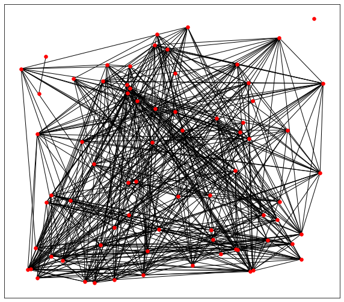

Created on 2019-08-20

# Graph Mining
Implement Newman-Girvan modified modularity algorithm from scratch and apply in transactional data to perform frequent itemset mining.

# Dataset Information:
Transactional dataset contains transactions of a retail company in a given period.
<i> 
- InvoiceNo: Invoice number. Nominal, a 6-digit integral number uniquely assigned to each transaction. If this code starts with letter 'c', it indicates a cancellation.

- StockCode: Product (item) code. Nominal, a 5-digit integral number uniquely assigned to each distinct product.

- Quantity: The quantities of each product (item) per transaction. Numeric.
</i>

# Graph mining techniques:

The transactional data will be imported then treated as bipartite graph with pre-defined source and target
The bipartite graph (B) then will be trasformed into weighted undirected graph (G) to be analysed using modified Newman Girvan
modularity. 

  

Detected communities after (n) optimal splits having maximum modularity are considered optimal clusters of items (StockCode) and will be compared with the results of other traditional frequent itemset mining techniques. 
